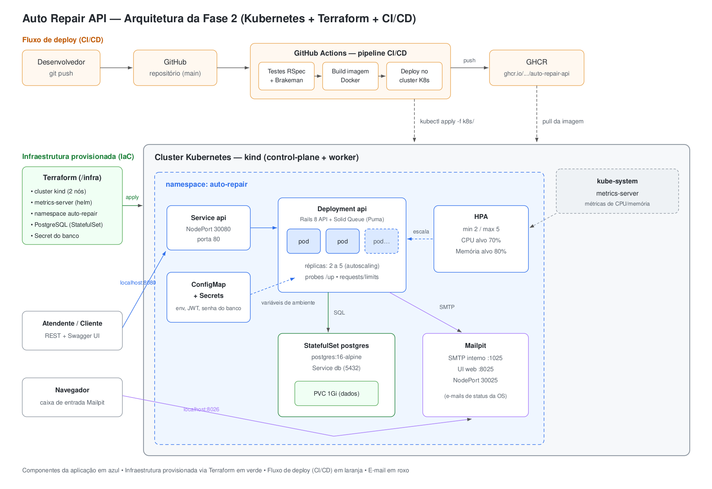

# Auto Repair API

Backend Rails 8.1 API-only para gerenciamento de uma oficina mecânica. Cobre ordens de serviço, cadastro de clientes/veículos, controle de estoque, fluxo de aprovação de orçamentos e notificação de clientes por e-mail.

## Fase 2 — Objetivos e solução

Evolução da aplicação da Fase 1 com foco em qualidade, resiliência e escalabilidade:

- **Kubernetes** — aplicação orquestrada em cluster kind com Deployments, Services, ConfigMaps/Secrets e **HPA** (autoscaling por CPU/memória)
- **Terraform** — provisionamento completo da infraestrutura como código (cluster, metrics-server, namespace e banco de dados)
- **CI/CD** — pipeline no GitHub Actions: testes → análise de segurança → build da imagem → deploy no cluster
- **Novas APIs** — abertura de OS recebendo dados de cliente/veículo, listagem com ordenação por prioridade de status e notificação de atualização de status via e-mail

## Desenho da arquitetura



- **Componentes da aplicação** (azul): pods da API Rails atrás de um Service NodePort, escalados pelo HPA entre 2 e 5 réplicas; ConfigMap/Secrets injetam configuração e credenciais
- **Infraestrutura provisionada** (verde): Terraform cria o cluster kind, o metrics-server (pré-requisito do HPA), o namespace e o PostgreSQL com volume persistente
- **Fluxo de deploy** (laranja): push na `main` → GitHub Actions roda testes e análise estática → build da imagem Docker → push para o GHCR → deploy no cluster com os manifestos de `k8s/`
- **E-mail** (roxo): a API envia os e-mails de status da OS para o Mailpit (SMTP de demonstração) com interface web para visualização

## Stack

- **Ruby 3.4.3** / **Rails 8.1** — API-only, Solid Queue para jobs assíncronos (e-mails)
- **PostgreSQL 16** — índices únicos parciais, CHECK constraints, saldo de estoque via CASE-SUM
- **JWT HS256** — autenticação de admins (TTL 24h)
- **RSpec** + **rswag** — testes geram a documentação OpenAPI automaticamente
- **Docker / Kubernetes (kind) / Terraform / GitHub Actions**
- **Mailpit** — SMTP de demonstração com UI web

## Arquitetura da aplicação

O projeto segue **Clean Architecture** organizada em contextos delimitados (DDD) em `app/domains/`:

```
app/domains/
  identity/        # Usuário, JWT, caso de uso de autenticação
  registries/      # Cliente, Veículo, Serviço — value objects CPF/CNPJ/placa
  inventory/       # Peça, Movimentação de estoque, calculadora de saldo
  service_orders/  # Ciclo completo: máquina de estados, aprovação, orçamento, notificação
  reports/         # Queries de métricas
```

Mapeamento das camadas:

| Camada (Clean Architecture) | No projeto |
|---|---|
| **Entities** — regras de negócio corporativas | `app/domains/*/entities`, `value_objects` (CPF, CNPJ, placa, status) e `services` de domínio (máquina de estados, calculadora de orçamento) |
| **Use Cases** — regras de negócio da aplicação | `app/domains/*/use_cases` (criação/transição/aprovação de OS, autenticação, movimentação de estoque) e `queries` (listagens e métricas) |
| **Interface Adapters** — conversão de dados | `app/controllers` (REST/JSON, controllers finos que rendem um objeto `Result`), `app/mailers` + views de e-mail |
| **Frameworks & Drivers** — detalhes | Rails, PostgreSQL, SMTP, Solid Queue, JWT |

A regra de dependência aponta para dentro: controllers dependem de use cases, que dependem de entidades — nunca o contrário. A comunicação entre camadas usa o objeto `Result` (sucesso/falha + payload/erros), e efeitos colaterais de borda (como envio de e-mail) ficam atrás de serviços de domínio (`CustomerNotifier`), mantendo os use cases testáveis e o framework substituível. Casos de uso só existem onde há lógica de negócio real; CRUDs simples falam com o model diretamente.

## Execução local (docker compose)

```bash
docker compose up --build
docker compose exec api bin/rails db:create db:migrate db:seed
```

- API: `http://localhost:3000`
- Swagger UI: `http://localhost:3000/api-docs`
- Mailpit (e-mails enviados): `http://localhost:8025`

## Provisionamento da infraestrutura (Terraform)

Pré-requisitos: Terraform >= 1.5, Docker e kubectl.

```bash
cd infra
terraform init
terraform apply
export KUBECONFIG=$(terraform output -raw kubeconfig_path)
```

O que é criado: cluster kind (control-plane + worker, com portas mapeadas para o host), metrics-server via Helm, namespace `auto-repair`, PostgreSQL 16 (StatefulSet + PVC + Service) e o Secret do banco. Detalhes de cada recurso e variáveis em [infra/README.md](infra/README.md).

## Deploy em Kubernetes

Com a infraestrutura provisionada:

```bash
# build local da imagem e carga no cluster (alternativa ao pull do GHCR)
docker build -f Dockerfile.production -t ghcr.io/igorsantosxp/auto-repair-api:latest .
kind load docker-image ghcr.io/igorsantosxp/auto-repair-api:latest --name auto-repair

kubectl apply -f k8s/
kubectl -n auto-repair wait --for=condition=complete job/db-migrate --timeout=300s
kubectl -n auto-repair rollout status deployment/api

# seed do usuário admin
kubectl -n auto-repair exec deploy/api -- bin/rails db:seed
```

- API: `http://localhost:8080` (Swagger UI em `/api-docs`)
- Mailpit: `http://localhost:8026`

Manifestos em [k8s/](k8s/): Deployment da API (2 réplicas, probes em `/up`, requests/limits), Service NodePort, **HPA** (2–5 réplicas, CPU 70% / memória 80%), ConfigMap, Secrets, Mailpit e Job de migração.

### Demonstração do autoscaling

```bash
# terminal 1 — acompanhe o HPA
kubectl -n auto-repair get hpa,pods -w

# terminal 2 — gere carga
./script/load_test.sh http://localhost:8080 300 30
```

## CI/CD

Pipeline em [.github/workflows/ci.yml](.github/workflows/ci.yml), disparada em push na `main`:

1. **scan_ruby** — Brakeman + bundler-audit
2. **test** — RSpec completo (SimpleCov ≥ 80% nos domínios críticos)
3. **build_image** — build da imagem de produção e push para `ghcr.io/igorsantosxp/auto-repair-api` (tags `latest` e SHA)
4. **deploy** — provisiona um cluster kind efêmero no runner via Terraform, carrega a imagem, aplica os manifestos de `k8s/`, roda a migração e faz smoke test em `/up`

> O deploy do CI usa um cluster efêmero de demonstração (a escolha de cluster local elimina custos de cloud); o mesmo fluxo se aplica sem alterações a um cluster gerenciado, trocando o provider no Terraform.

## Documentação da API (collection)

- **Swagger UI interativo**: `http://localhost:3000/api-docs` (local) ou `http://localhost:8080/api-docs` (Kubernetes)
- **Spec OpenAPI**: [swagger/v1/swagger.yaml](swagger/v1/swagger.yaml) — importável no Postman/Insomnia

Para regenerar a partir dos testes: `bundle exec rake rswag:specs:swaggerize`

## Principais Endpoints

### Auth

| Método | Caminho | Descrição |
|--------|---------|-----------|
| POST | `/api/v1/auth/login` | Retorna token JWT |

### Admin (Bearer token obrigatório)

| Método | Caminho | Descrição |
|--------|---------|-----------|
| GET/POST | `/api/v1/customers` | Listar / criar clientes |
| GET/PATCH/DELETE | `/api/v1/customers/:id` | Exibir / atualizar / soft delete |
| GET/POST | `/api/v1/vehicles` | Listar / criar veículos |
| GET/POST | `/api/v1/services` | Listar / criar serviços |
| GET/POST | `/api/v1/parts` | Listar / criar peças |
| GET | `/api/v1/parts/:id/stock` | Saldo atual em estoque |
| POST | `/api/v1/parts/:part_id/stock_movements` | Registrar entrada/saída/ajuste |
| GET/POST | `/api/v1/service_orders` | Listar / criar ordens de serviço |
| GET/PATCH | `/api/v1/service_orders/:id` | Exibir / atualizar ordem |
| POST | `/api/v1/service_orders/:id/transitions` | Avançar status da ordem |
| GET | `/api/v1/reports/metrics` | Tempo médio de execução (filtro por data) |

**Abertura de OS**: `POST /api/v1/service_orders` aceita `customer_id`/`vehicle_id` de registros existentes **ou** os objetos `customer`/`vehicle` com os dados completos — cliente é localizado pelo documento (CPF/CNPJ) e veículo pela placa; se não existirem, são criados. Retorna a identificação única (`uuid`) da OS.

**Listagem de OS**: ordenada por prioridade de status — Em Execução > Aguardando Aprovação > Diagnóstico > Recebida — e, dentro do mesmo status, mais antigas primeiro. Ordens finalizadas e entregues não aparecem na listagem (exclusão lógica; continuam consultáveis pelo filtro `status`).

### Cliente (sem autenticação)

| Método | Caminho | Descrição |
|--------|---------|-----------|
| GET | `/api/v1/customer/service_orders/:uuid` | Status da ordem (visão pública) |
| POST | `/api/v1/customer/service_orders/:uuid/approve` | Aprovar orçamento |
| POST | `/api/v1/customer/service_orders/:uuid/reject` | Rejeitar orçamento |

### Admin padrão (seed)

```
email: admin@autorepair.com
senha: admin123456
```

## Ciclo de Vida da Ordem de Serviço

```
received → in_diagnosis → awaiting_approval → approved → in_execution → finished → delivered
                                           ↘ finished (rejected) → delivered
```

### Eventos de transição (admin)

| Status atual | Evento | Próximo status |
|---|---|---|
| `received` | `start_diagnosis` | `in_diagnosis` |
| `in_diagnosis` | `send_for_approval` | `awaiting_approval` |
| `awaiting_approval` | `send_for_approval` | `awaiting_approval` (reenvio — invalida token anterior) |
| `approved` | `start_execution` | `in_execution` |
| `in_execution` | `finalize` | `finished` |
| `finished` | `deliver` | `delivered` |

### Fluxo de aprovação e notificações

1. Atendente envia para aprovação (`send_for_approval`) — a API retorna um `approval_link` com token único (SHA256, TTL 7 dias) e o cliente recebe um **e-mail** com o orçamento e o link
2. Cliente aprova (`POST .../approve`) — ordem vai para `approved`; estoque **não** é movimentado neste momento
3. Atendente aciona `start_execution` — estoque é reservado e itens marcados como executados
4. Se o estoque estiver insuficiente, o erro aparece apenas para o atendente — o cliente nunca vê erros internos de estoque

**A cada mudança de status a API envia um e-mail ao cliente** (de forma assíncrona, via Solid Queue). Em desenvolvimento e na demo Kubernetes os e-mails chegam no Mailpit.

Ao rejeitar, o total é zerado e nenhuma movimentação de estoque é gerada. O veículo ainda transiciona para `delivered` pois está fisicamente na oficina.

Todas as respostas de ordem de serviço incluem o campo `available_events` indicando quais eventos podem ser acionados a partir do status atual.

## Testes

```bash
bundle exec rspec
```

SimpleCov exige ≥ 80% de cobertura nos domínios críticos. O relatório é gerado em `coverage/index.html` (não versionado).

## Análise de Segurança

- `brakeman_report.html` — Brakeman (80+ categorias de vulnerabilidades Rails)
- `bundler_audit_report.txt` — bundler-audit contra ruby-advisory-db

Resultado: **0 vulnerabilidades** encontradas pelas ferramentas automatizadas. Ambas rodam no CI.

## Vídeo demonstrativo

> _Link do vídeo (YouTube/Vimeo) — será adicionado na entrega._
