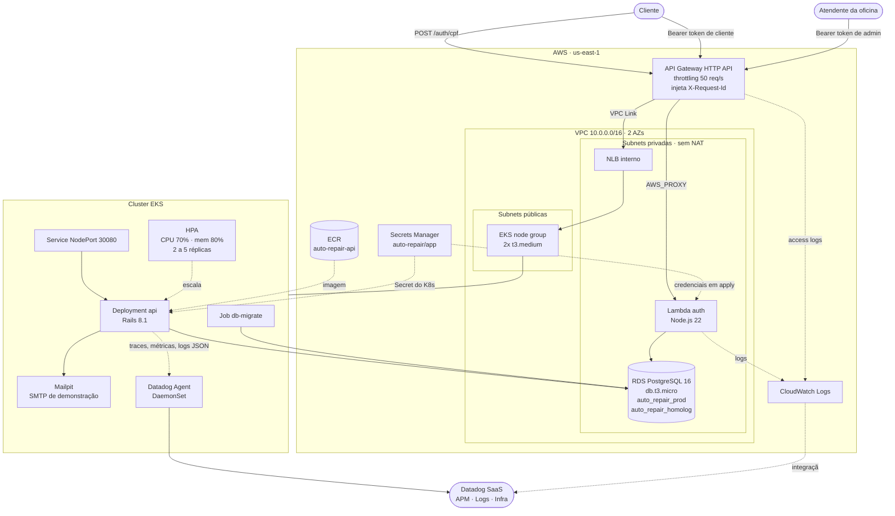
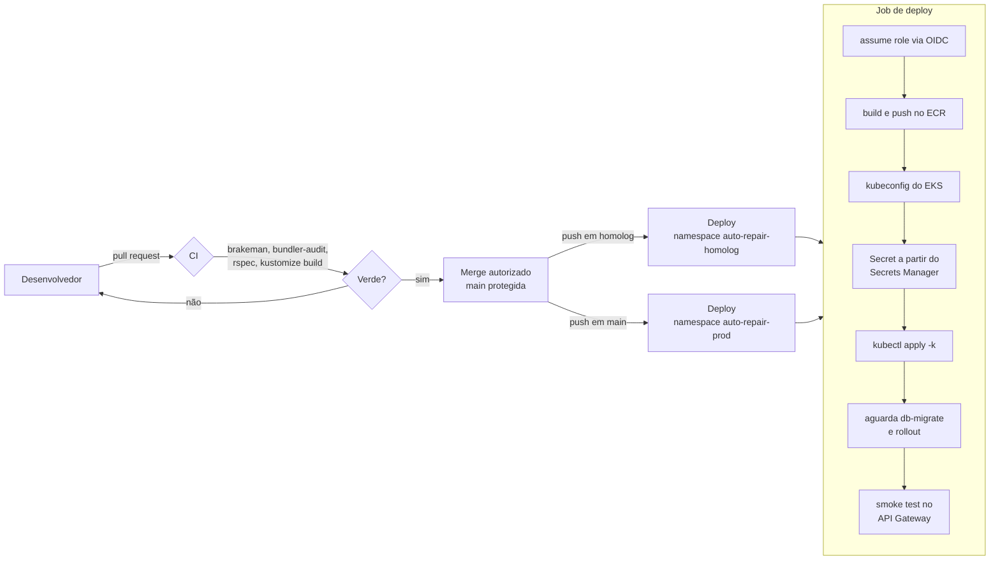

# Diagrama de componentes

Visão de nuvem da solução: APIs, banco, monitoramento e o que provisiona cada
parte.

## Provisionamento por repositório

| Repositório | Cria |
|---|---|
| `auto-repair-infra-k8s` | VPC, subnets, EKS, node group, ECR, NLB, API Gateway, VPC Link, role OIDC, Datadog Agent |
| `auto-repair-infra-database` | RDS, subnet group, security group, Secrets Manager |
| `auto-repair-auth-lambda` | Lambda, role, security group, rota `POST /auth/cpf` |
| `auto-repair-api` | Imagem no ECR, namespaces, Deployment, Service, HPA, Job de migração, Mailpit |

## Fluxo de deploy

Nenhum dos quatro pipelines guarda credencial AWS de longa duração: todos
assumem a role `auto-repair-github-actions` por **OIDC**, com token de curta
duração emitido pelo próprio GitHub.
