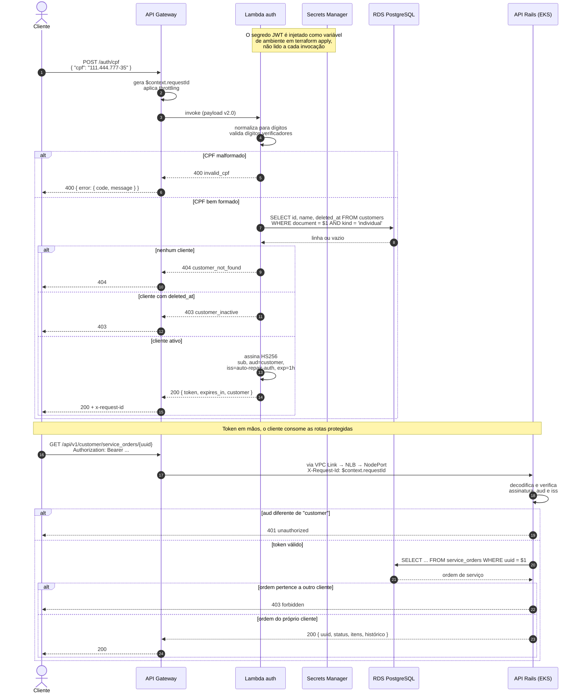

# Diagrama de sequência — autenticação por CPF

Fluxo completo desde o CPF até o consumo de uma rota protegida.

## Pontos de atenção

**Por que `aud` importa.** Sem verificar o público, o token emitido pela Lambda
abriria também as rotas administrativas, e um cliente autenticado por CPF teria
acesso ao CRUD inteiro. A aplicação valida `aud` e `iss` em toda decodificação.

**Por que a checagem de posse existe.** Autenticar prova quem é o cliente, não a
que ordem ele tem direito. Sem o 403, bastaria trocar o UUID na URL para ler a OS
de outra pessoa.

**Correlação.** O `requestId` gerado pelo gateway aparece no log de acesso do
próprio gateway, no log estruturado da Lambda e — via header `X-Request-Id` — em
cada linha de log do Rails, junto do `dd.trace_id`. É o que permite seguir uma
requisição de ponta a ponta no Datadog.

**A limitação de segurança** desta estratégia está documentada no
[RFC 0003](../rfc/0003-estrategia-de-autenticacao.md): CPF é identificador
público, não credencial.
