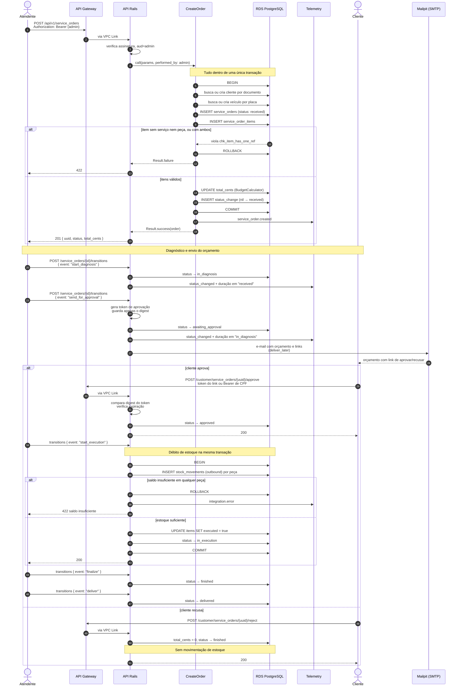
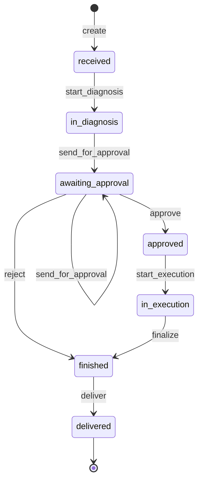

# Diagrama de sequência — abertura e ciclo de vida da ordem de serviço

## Máquina de estados

Transições inválidas são rejeitadas pela `StateMachine` antes de tocar o banco, e
a constraint `chk_service_orders_status` garante no PostgreSQL que nenhuma
escrita externa introduza um estado fora dessa lista.

## Onde nascem as métricas do dashboard

| Métrica no Datadog | Origem |
|---|---|
| `auto_repair.service_order.created` | `CreateOrder`, após o commit |
| `auto_repair.service_order.status_changed` | `TransitionOrder`, com tags `from`, `to` e `event` |
| `auto_repair.service_order.status_duration` | `TransitionOrder`, diferença até a transição anterior, com tag do status que terminou |
| `auto_repair.integration.error` | Falhas de reserva de estoque e de envio de e-mail |

A duração é calculada a partir de `service_order_status_changes`, que já
registrava o histórico desde a Fase 1.
