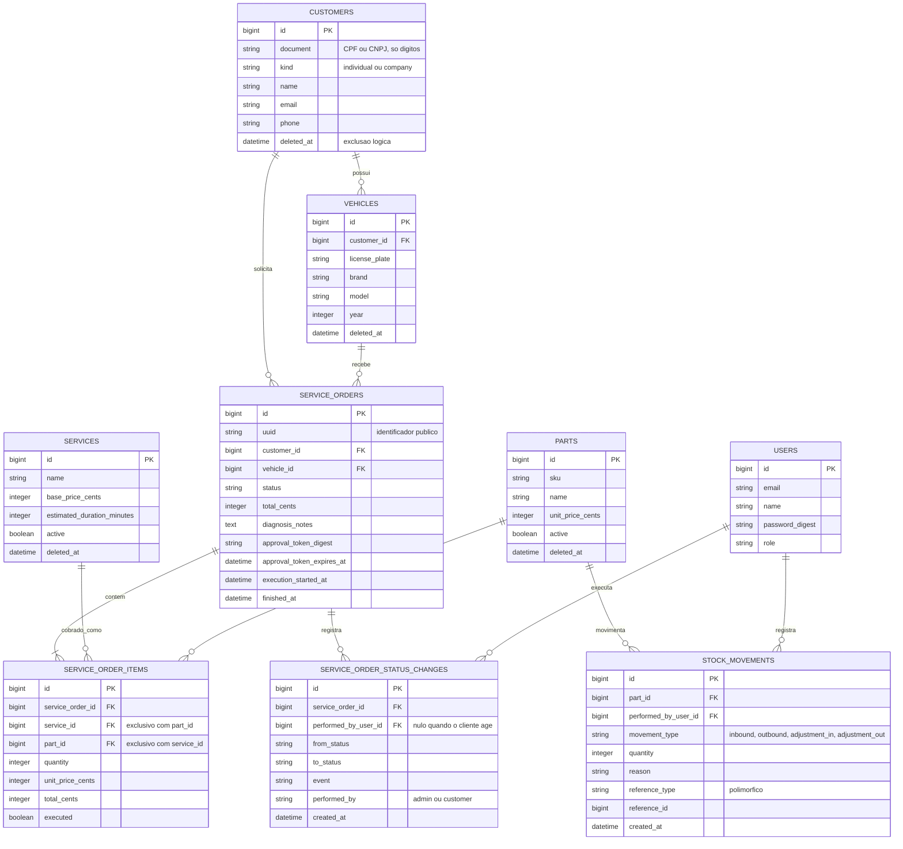

# Diagrama ER e relacionamentos

A justificativa formal da escolha do PostgreSQL e o detalhamento dos ajustes
feitos no modelo estão no [RFC 0002](../rfc/0002-escolha-do-banco-de-dados.md).
Este documento descreve o modelo como ele está hoje.

## Diagrama



## Explicação dos relacionamentos

### Cliente, veículo e ordem de serviço

`CUSTOMERS 1—N VEHICLES` e `CUSTOMERS 1—N SERVICE_ORDERS`. Um veículo pertence a
um único cliente, com chave estrangeira obrigatória.

A ordem de serviço referencia **cliente e veículo separadamente**, e não apenas o
veículo. Poderia-se argumentar que o cliente é derivável pelo veículo, mas
manter as duas referências preserva a verdade histórica: se um carro for vendido
e o veículo passar para outro dono, as ordens antigas continuam apontando para
quem de fato contratou o serviço. A aplicação valida a coerência entre os dois no
momento da abertura (`Errors::VehicleOwnershipConflict`).

### Itens da ordem

`SERVICE_ORDERS 1—N SERVICE_ORDER_ITEMS`, e cada item aponta para **um serviço ou
uma peça, nunca ambos**. Essa exclusividade é garantida no banco pela constraint
`chk_item_has_one_ref`:

```sql
service_id IS NOT NULL AND part_id IS NULL
OR service_id IS NULL AND part_id IS NOT NULL
```

É o padrão de herança por tabela única aplicado à linha de orçamento: mão de obra
e peça têm preço, quantidade e total, mas origens diferentes no catálogo.

O item **copia** `unit_price_cents` do catálogo no momento da inclusão, em vez de
consultar o preço atual pela chave estrangeira. Sem isso, reajustar o preço de
uma peça alteraria retroativamente o valor de orçamentos já aprovados.

### Histórico de status

`SERVICE_ORDERS 1—N SERVICE_ORDER_STATUS_CHANGES`, append-only. Cada linha
guarda `from_status`, `to_status` e o `event` que causou a transição.

`performed_by_user_id` é **nulo quando o cliente age** — aprovação e recusa de
orçamento vêm do cliente, que não é um `USERS`. A coluna `performed_by` (`admin`
ou `customer`) registra a origem nesse caso.

Esta tabela é a fonte das métricas de tempo médio por status exigidas no
dashboard: a duração em um estado é a diferença entre transições consecutivas.

### Estoque

`PARTS 1—N STOCK_MOVEMENTS`, também append-only. **O saldo não é uma coluna** —
é calculado somando as movimentações (`StockBalanceCalculator`). Um campo de
saldo denormalizado seria mais rápido de ler, mas exigiria atualização atômica em
cada movimentação e perderia a auditoria de como se chegou àquele número.

`reference_type` e `reference_id` formam uma referência polimórfica à origem da
movimentação — hoje sempre uma ordem de serviço, quando peças são debitadas no
início da execução. Não há chave estrangeira, por ser polimórfica; a integridade
depende da aplicação.

### Exclusão lógica

`CUSTOMERS`, `VEHICLES`, `SERVICES` e `PARTS` têm `deleted_at`. `SERVICE_ORDERS`
não: ordens nunca são excluídas, apenas mudam de status.

A unicidade funciona por **índice único parcial**, por exemplo:

```sql
CREATE UNIQUE INDEX index_customers_on_document_active
ON customers (document) WHERE deleted_at IS NULL;
```

Assim um CPF pode ser recadastrado depois de excluído, mantendo unicidade entre
os registros ativos. Este é um dos motivos concretos da escolha do PostgreSQL —
MySQL não tem índice parcial.
